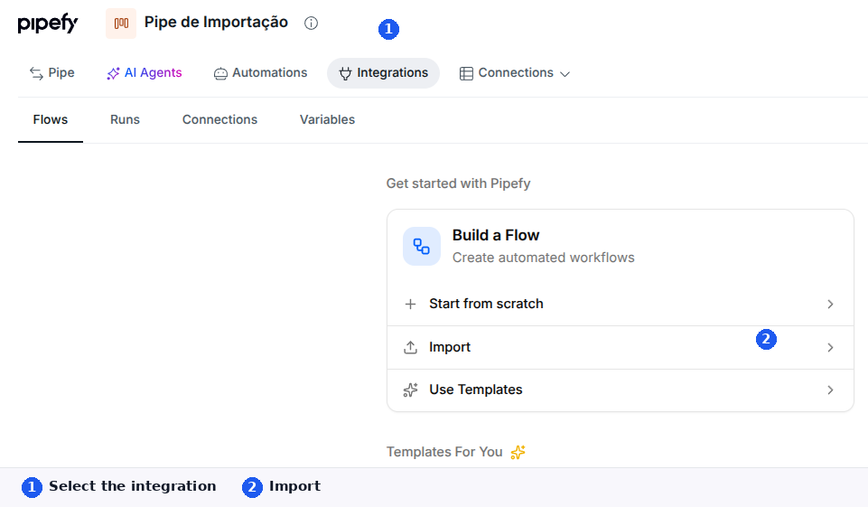

# Playbook do migrador Workato (cliente, com navegador)

Versão 0.5.7. O kit vigente é [github.com/pipefy/ipaas-migrator](https://github.com/pipefy/ipaas-migrator) (`main`, arquivo `VERSION`). Variante **com navegador**. Datapill Pipefy sai com colchetes: `{{trigger['data']['card']['id']}}`. A chave é `data`. O import coloca `['output']` em volta.

O arquivo final é um `*.flow.json` (cópia nomeada ao lado de `flow.json`). O agente não publica.

## Status (não misturar)

| Campo | Só é sim quando |
| --- | --- |
| Arquivo gerado | o path absoluto existe no disco |
| Importação confirmada | o canvas **desta** receita está aberto |
| Configuração incompleta | falta conexão, pipe hospedeiro ou fase |
| Lógica pendente | há TODO / Ruby / CODE no rascunho |
| Teste validado | houve run ou evento real |

Arquivo gerado não significa flow pronto. Operações mapeadas não substituem o teste.

## O que o kit faz

1. Instala o motor e a skill. Compara o `VERSION` com o GitHub e avisa se `main` estiver mais novo. Só anuncia pronto depois de um smoke do motor.
2. Infere o idioma do chat (pergunta só se estiver ambíguo).
3. Pergunta a fonte se ainda não veio: API client Workato ou JSON.
4. Diagnostica a receita (gatilho, cron literal, pipes, fases, conexões) e traduz.
5. Se o chat tem `Conexão: <id>`, o flow já sai ligado.
6. Explica o navegador e espera o ok.
7. Sim: abre o Chrome do agente. Você entra (SSO é com você). Ele guia Import e confere o canvas.
8. Depois do login: explica o MCP Pipefy e espera outro ok. Sem ok, segue no clique.
9. Acompanha conexões e teste. Não publica.

O pipe do Integrations (onde o flow mora) pode ser outro que o pipe cujos cards a receita mexe.

## O que o kit não faz

Não abre o navegador sem o ok. Não liga MCP sem o ok. Não instala Bituca, Chrome DevTools nem MCP de iPaaS. Não publica. Não cola senha no chat. Não usa OEM.

MCP Pipefy só entra depois do login no Chrome do agente e do segundo ok. Sem isso, o tutor continua no clique.

## O que você precisa

| | |
| --- | --- |
| Agente | Cursor, Claude Code ou Codex. |
| Node.js 18.17 ou mais novo | Sem permissão na máquina, fale com o TI. |
| Receita | API client Workato ou JSON com `code`. |
| Pipefy | Integrações na org e admin no pipe. |

## Instalar

Abra [github.com/pipefy/ipaas-migrator](https://github.com/pipefy/ipaas-migrator) (`main`) no chat e cole:

```
Instale o migrador com navegador e vamos migrar a receita.
```

## Importar

Depois do `*.flow.json` o agente pergunta se pode abrir o navegador. Sem ok, use o print `importar/01-integrations-import.png`:

1. Selecione o pipe.
2. Clique em Integrations.
3. Em Build a Flow, clique em Import e escolha o `*.flow.json` desta receita.

Ligue conexões no painel (Service Account no conector Pipefy, não no chat), **ou** cole o id iPaaS no chat:

```
Conexão: <id>
```

Com o id, o `flow.json` já sai ligado. Importe no mesmo pipe dessa conexão.

O aviso de 24 horas na tela da Service Account vale para o **token gerado**, não para a conta. Teste o gatilho com um evento real. Não publique até conferir.



## Problemas comuns

| Erro | O que checar |
| --- | --- |
| `missing_token` | `WORKATO_API_KEY` no `.env`. |
| `unauthorized` | Token do workspace certo. |
| `tsx_missing` | Peça no chat para instalar de novo. |
| smoke falhou | Node ≥ 18.17 e `npm ci` na raiz do pack. Sem isso o kit não está pronto. |
| SSO na janela do agente | Take Control, entre, volte ao chat. |
| Sem aba Integrations | Integrações na org; você é admin daquele pipe. |
| Conexão no flow vazia | Cole `Conexão: <id>` e traduza de novo, ou ligue no painel. |
| Fase da receita não existe no pipe | O diagnóstico lista as fases do JSON. Confira no pipe de destino (MCP ajuda depois do login). |

## Versão

Arquivo `VERSION` na raiz. A variante sem navegador saiu de linha (0.4.3): [PLAYBOOK.md](PLAYBOOK.md) e [README.md](README.md).
